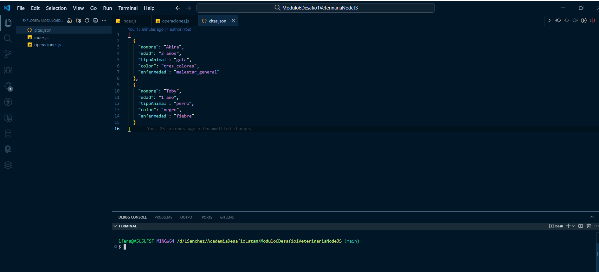

# Módulo 6 Introducción a Node JS - Desafío - Veterinaria Js

## Pantalla VSCode 

##  

## Descripción del PY ⌨️
En este proyecto aplico los conocimientos de Node Js, desarrollando una  aplicación backend que registre los datos de atención en una veterinaria.

1. Funcionalidad del archivo index.js

   Este archivo es el punto de entrada de la aplicación, donde se definen las condiciones para registrar o leer las citas según los argumentos pasados por línea de comandos.

2. Archivo operaciones.js

   Aquí defino las funciones para registrar una nueva cita y para leer todas las citas registradas.

3. Archivo citas.json

   Este archivo inicialmente contiene un arreglo vacío:  []

##  

## Tecnologías Usadas 🛠️

- **JS** 🧑‍💻
- **Node JS**
- Utilizo el módulo fs de Node.js para leer y escribir en el archivo citas.json

 

---

 

## Autor 👨‍💻

**Luis Fernando Sanchez F. - Desarrollador Fullstack G60⚡**

Sígueme en mis redes sociales: 
 
